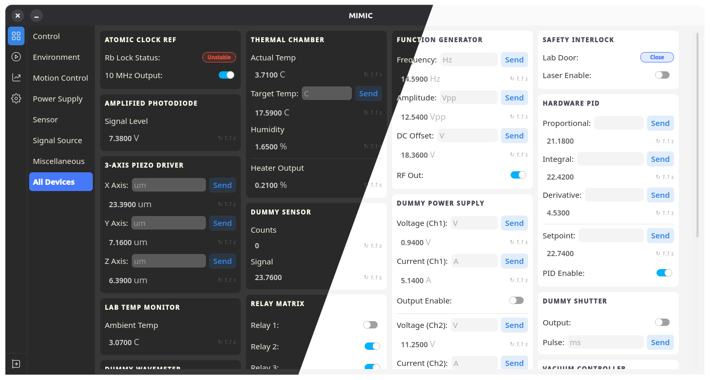
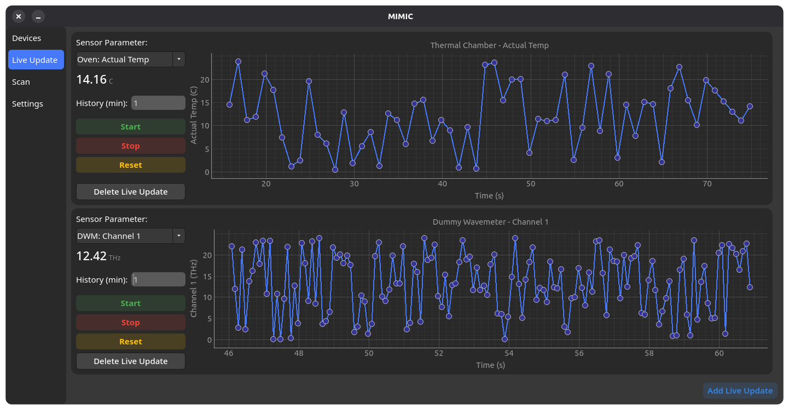
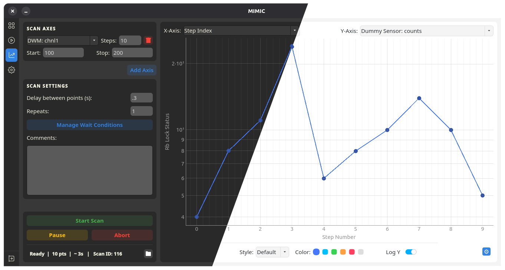
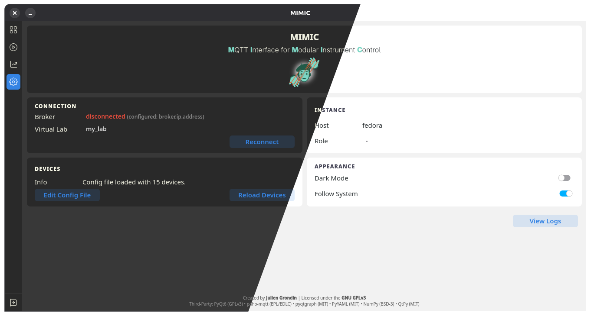

# MIMIC - MQTT Interface for Modular Instrument Control

[](https://www.python.org/)
[](LICENSE)
[](https://eclipse.dev/paho/)


## Overview

MIMIC is a **PyQt6-based GUI** for controlling and monitoring scientific instruments over MQTT. Devices are defined entirely in a YAML configuration file, no code changes are required to add a new instrument. It was developed in a laboratory context and is designed to act as a centralised, real-time control hub for heterogeneous hardware.

**Features:**

- **YAML-driven device configuration** add any device by editing `config/devices_configuration.yaml`
- **Real-time monitoring** parameters update live via MQTT subscriptions
- **Command interface** send commands directly from the GUI
- **Light / Dark theming** system-aware, switchable at runtime
- **Scan tab** sweep a parameter across a range and record data
- **Simulation mode** fake MQTT backend for offline development
- **Master / Listener instances** multiple windows sharing state; listener windows disable the Scan tab

### Screenshots

| Devices | Live View | Scan | Settings |
|---------|-----------|------|----------|
|  |  |  |  |


## Installation

### Prerequisites

- **Python ≥ 3.11**
- A running **MQTT broker** (e.g. [Mosquitto](https://mosquitto.org/)) reachable from your machine

### 1. Clone the repository

```bash
git clone https://github.com/JulienGrdn/MIMIC.git
cd MIMIC
```

### 2. Create and activate a virtual environment

**Linux / macOS**
```bash
python -m venv venv # or python3 -m venv venv (macOS)
source venv/bin/activate # or source venv/bin/activate.fish if you are using fish
```

**Windows (cmd)**
```cmd
python -m venv venv
venv\Scripts\activate
```

**Windows (PowerShell)**
```powershell
python -m venv venv
venv\Scripts\Activate.ps1
```

### 3. Install the package

```bash
pip install .
```

For development (includes pytest and testing utilities):

```bash
pip install -e ".[dev]"
```

### 4. Launch

```bash
mimic
```

> MIMIC will look for `config/devices_configuration.yaml` relative to the directory from which the command is run. Run it from the repo root so the default config is picked up automatically.

---

## Simulation / Fake Backend

To use and try the UI without real hardware, run the fake MQTT backend in one terminal and MIMIC in another:

```bash
# Terminal 1 — start a MQTT broker (e.g. localhost with eclipse-mosquitto on docker)
# Terminal 2 — start the fake backend:
python example/fake_backend_gui.py

# Terminal 3 — launch the app
mimic
```

---

## Device Configuration

All instruments are defined in `config/devices_configuration.yaml` — no Python code changes required. The file lists the MQTT broker address, an optional lab-wide topic namespace (`virtual_lab`), and a `devices` list where each entry maps a device's display properties and MQTT topics to UI widgets.

```yaml
broker: "192.168.1.100"
virtual_lab: "my_lab"

devices:
  - id: "my_power_supply"
    name: "Power Supply"
    nickname: "PSU"
    device_cat: "Power Supply"
    mqtt_base_topic: "powersupply/sn42"
    channels:
      - key: "voltage"
        label: "Voltage"
        type: "float"
        access: "read_write"
        unit: "V"
        status_suffix: "v"
        command_suffix: "SET/v"
```

For the full reference — every parameter, all `type` and `access` options, payload format extraction, stability indicators, timestamp coupling, and annotated examples — see the **[Device Configuration Guide](./config/DEVICE_CONFIGURATION_GUIDE.md)**.

---

## Persistent UI State

* `config/ui_parameters.json` — saved on exit, restored on startup (line edits, combo boxes, check boxes, theme)
* `config/scan_axes.json` — scan experiment configuration

---

## Master / Listenner Mode

Open a second MIMIC window and **"Listener"** mode will automatically be triggered, can me manage in Settings.
Listener instances subscribe to the same MQTT topics but have the **Scan tab disabled**, preventing conflicting scan operations.

---

## Local Development

```bash
# Editable install with dev dependencies
pip install -e ".[dev]"

# Run the test suite
pytest
```

---

## Project Structure

* **Entry point**
  `MIMIC.py`, `src/mimic/app.py`

* **Main window & tabs**
  `src/mimic/main_window.py`, `src/mimic/tabs/`

* **Device model**
  `src/mimic/devices/frontend/instrument_base.py`
  (`Parameter`, `InstrumentBase`)

* **YAML device loader**
  `src/mimic/devices/yaml_plugin.py`

* **MQTT transport**
  `src/mimic/devices/frontend/mqtt_handler.py`
  `universal_mqtt.py`, `mqtt_broker_registry.py`

* **Theming & style**
  `src/mimic/assets/csstyle.py`, `theme_manager.py`

* **Custom widgets**
  `src/mimic/widgets/`


---

## Credits & Licensing

**License:** GNU General Public License v3.0 (GPLv3)

This project is licensed under GPLv3 because it relies on **PyQt6**, which is GPL-licensed. As a result the entire application is copyleft open-source software.

See the [LICENSE](LICENSE) file for the full text.


## Third-Party Libraries

* **PyQt6** - GPL v3
* **paho-mqtt** - EPL 2.0 / EDL 1.0
* **pyqtgraph** - MIT
* **PyYAML** - MIT
* **numpy** - BSD 3-Clause

Vectors and icons by [SVG Repo](https://www.svgrepo.com).